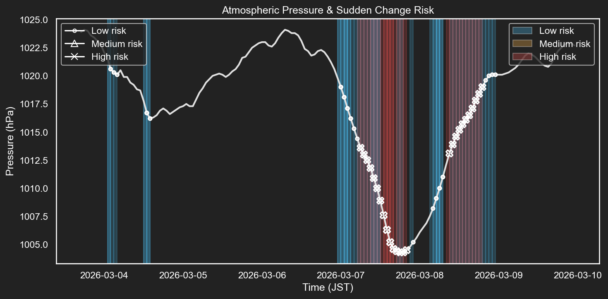

[](https://github.com/kody-abbey/air-pressure-alert/actions/workflows/github-actions.yml)


# Air Pressure Alert

- [Air Pressure Alert](#air-pressure-alert)
  - [Overview](#overview)
  - [Example Output](#example-output)
  - [Tech Stack](#tech-stack)
  - [Design Considerations](#design-considerations)
  - [Architecture](#architecture)
  - [How It Works](#how-it-works)
  - [Setup](#setup)
  - [Automation](#automation)
  - [Motivation](#motivation)

## Overview

Atmospheric pressure monitoring and alert system that:

- Fetches weather data
- Detects sudden pressure changes
- Generates visualization graphs
- Sends alerts to Discord via Webhook
- Runs automatically via GitHub Actions

## Example Output



## Tech Stack

- Python 3.x - Core language
- Requests - External API communication
- Pandas - Data processing
- Matplotlib (Agg) - Headless visualization for CI environments without GUI support
- GitHub Actions - Scheduled automation
- Discord Webhook - Alert delivery
- dotenv - Environment variable management

## Design Considerations

- Modular structure to separate data fetching, business logic, visualization, and notification layers
- Headless-compatible graph rendering for CI execution
- Environment variable management for secure webhook handling

## Architecture

```
app/
├── api/                # Weather data fetch
├── logic/              # Risk detection logic
├── visualization/      # Graph generation
├── notifier/           # Discord webhook
└── main.py             # Entry point
```

## How It Works

1. Fetch pressure data from Open-Meteo API
2. Calculate pressure delta
3. Detect sudden drop risk
4. Generate graph
5. Send image to Discord


## Setup

```
# 1.Clone repository
git clone ...

# 2.Install dependencies
pip install -r requirements.txt

# 3.Create .env
DISCORD_WEBHOOK_URL=your_webhook_url

# 4.Run
python app/main.py
```

## Automation

Runs automatically via GitHub Actions:

- Scheduled execution
- Headless matplotlib backend (Agg)
- Dependency installation
- Script execution

## Motivation

Built to experiment with:

- Automated backend workflows
- Data visualization
- CI-based execution
- Notification systems